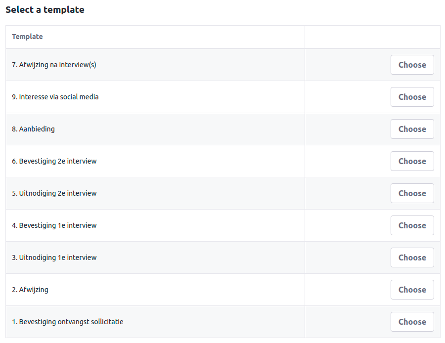
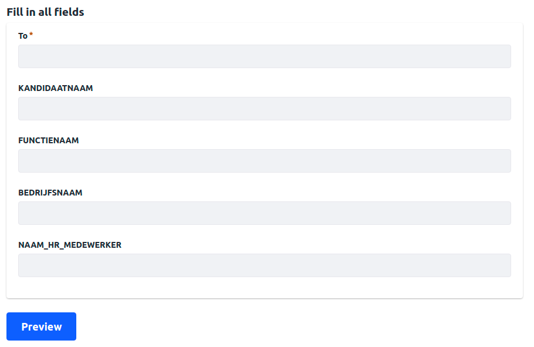
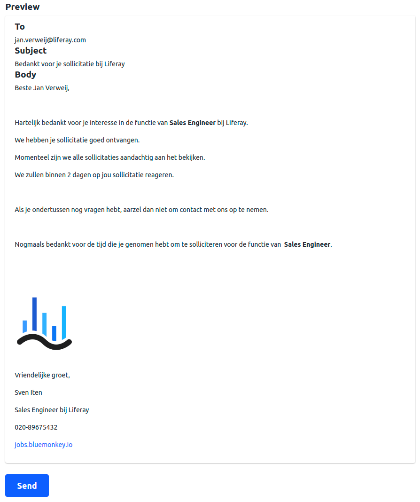
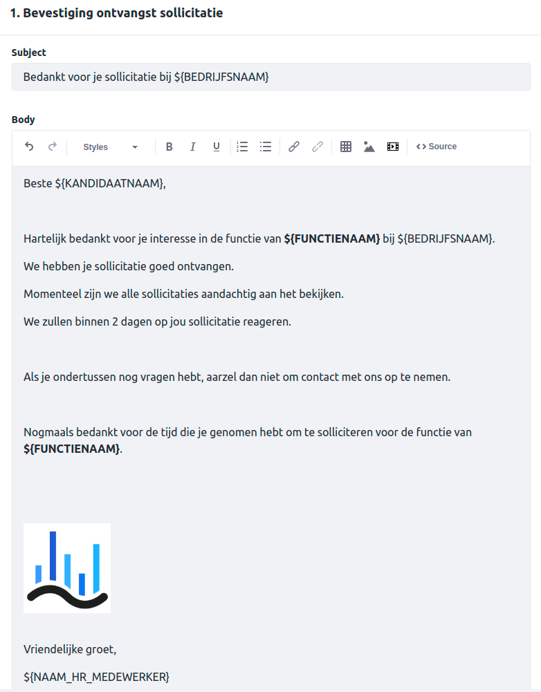

# templateMailer

Always wanted to have a standard response at your fingertips?
With templateMailer you can generate emails with flexible customizable fields.

Developed to run on the following versions of Liferay and/or Commerce: `Liferay DXP 7.3`

Built with [Liferay Workspace](https://help.liferay.com/hc/en-us/articles/360029147471-Liferay-Workspace) and [Blade CLI](https://help.liferay.com/hc/en-us/articles/360029147071-Blade-CLI).

*Include an image or gif that represents your project*

- choose a template
  
- fill out the form
  
- validate the preview and send
  
- create your own templates
  

https://youtu.be/wXgP2IBkyWY

## How to Build and Deploy to Liferay

Follow the steps below to build and deploy or copy the modules from the [releases](../../releases/latest) page to your Liferay's deploy folder.

In order to build or deploy this module you will need to [install Blade CLI](https://help.liferay.com/hc/en-us/articles/360028833852-Installing-Blade-CLI).

### To Build

`$ blade gw build`

You can find the built modules at `modules/{module-name}/build/libs/{module-name}.jar`.

### To Deploy

In `gradle-local.properties` add the following line to point towards the Liferay instance you want to deploy to:
```
liferay.workspace.home.dir=/path/to/liferay/home
```

`$ blade gw deploy`

## Usage

1. Deploy portlet and configure folderid where you store email templates based on custom structure
[Adding Widgets to a Page.](https://learn.liferay.com/dxp/7.x/en/site-building/creating-pages/using-widget-pages/adding-widgets-to-a-page.html)

2. Create a structure with a field **Subject** and a field **Body** [example](email.json)

## Some example templates

---
Subject: RFP Confirmation  
  
Hi ${first name},

I am honored that Liferay has been selected to respond for ${Company}’s business through an RFP. We look forward to showing ${Company} and the whole evaluation team why Liferay would be a strategic solution to address the current and future challenges that ${Company} is facing in their RFP process.

Based on the current status in the request, I will show how Liferay will help to: create a more consistent process across international regions, save individuals time to focus on other initiatives, and provide insights into all RFP analytics across your organization.

I will follow up within the next week with any questions we have about the RFP.
  
Thanks again for the opportunity!  
Konnor

---
Subject: Review session  

Hi ${first name},  
  
It is apparent that ${names} spent a lot of time putting this request together. Thanks for sending us such an organized RFP outline…they aren’t always delivered this way!
  
At this time we are still reviewing, and the requirements are aligning well with Liferay’s offerings. We have outlined a few comments and questions. We would like to schedule a one-hour review session with your team to cover everything.  
  
Is your team available at ${Date-and-Time} for this review session? Please confirm and I’ll send over a calendar invite.  
  
Thanks and talk soon!  
Konnor

---

### Features

* Create multiple templates
* Automatically identify variables in the template
* Send emails in html format


## Issues & Questions Welcome
--------------------


